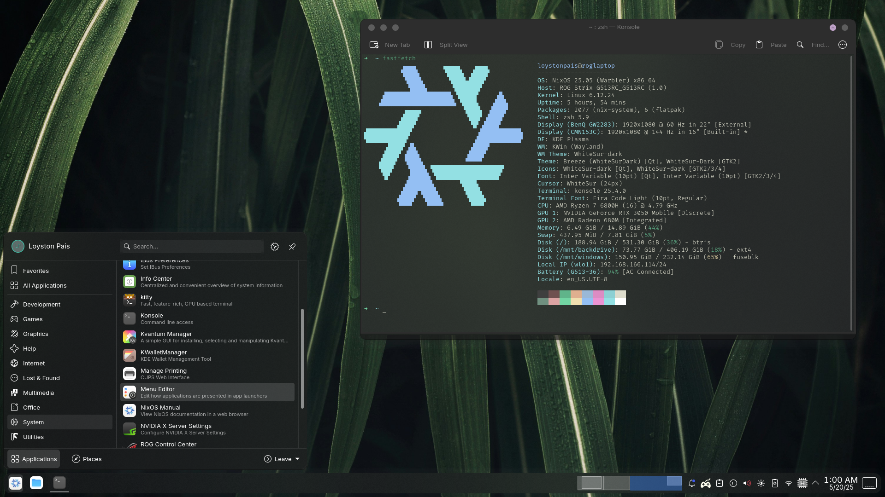
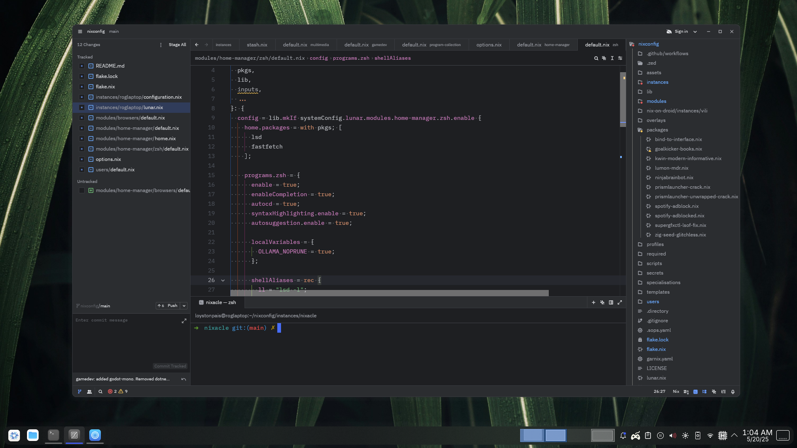

<h1 align="center">Lunar Nix</h1>

## What even is NixOS?

NixOS is an operating system that makes it easy to set up and maintain a **reproducible** environment. Instead of configuring everything by hand, you define your entire system setup in a single configuration file, which allows you to recreate the exact same setup on another machine or revert to a previous version if needed. This approach keeps your system stable, organized, and easy to update, making it ideal for users who want a reliable and reproducible setup with minimal hassle. Whether you’re a beginner or advanced user, NixOS helps you keep control over your environment with ease.

## Screenshots

More in assets/screenshots
