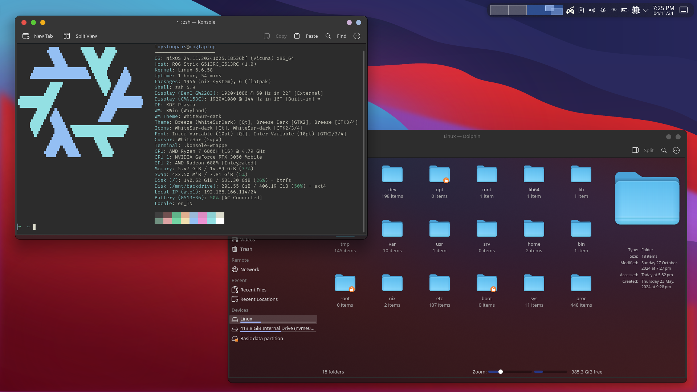

# Welcome to my nix config

Hi! This is my version of nix configuration.

## What even is NixOS?
NixOS is an operating system that makes it easy to set up and maintain a **reproducible** environment. Instead of configuring everything by hand, you define your entire system setup in a single configuration file, which allows you to recreate the exact same setup on another machine or revert to a previous version if needed. This approach keeps your system stable, organized, and easy to update, making it ideal for users who want a reliable and reproducible setup with minimal hassle. Whether you’re a beginner or advanced user, NixOS helps you keep control over your environment with ease.

# Screenshots




# Usage

The usage of the word "instances" over "hosts" is on purpose. This config is designed to handle multiple instances of nixos regardless of which device it is running on.

```sh 
./jesse.py nixos-instance import instanceName
```
Replace `instanceName` with any name you want. (Must be a valid hostname)

<br/>
When you run the above jesse command, a new folder named `instanceName` will be created in the `instances` folder along with few files.

```nix
# instances/instanceName/default.nix
{ self,  inputs,  ... }:
# can change nixpkgs below with nixpkgs-stable
inputs.nixpkgs.lib.nixosSystem {
  system  =  "x86_64-linux";
  
  specialArgs  = {
    inherit  inputs;
  };
  
  modules = [
    ../../core.nix
    ./configuration.nix
    ./hardware-configuration.nix
  ];
}
```

`core.nix` includes features from my config.

Go to the `configuration.nix` file and remove everything except the state version.
Add, 
```nix
vars.hostName = "anyhostname";
vars.graphicsMode = "none";
vars.bootMode = "uefi"; # change to bios if you are booting from bios
vars.profile.everything.enable = true; # enables almost everyting set up in the config
```
That should be enough to successfully run `sudo nixos-rebuild --flake .#instanceName`.
Additionally, read `defvars.nix`