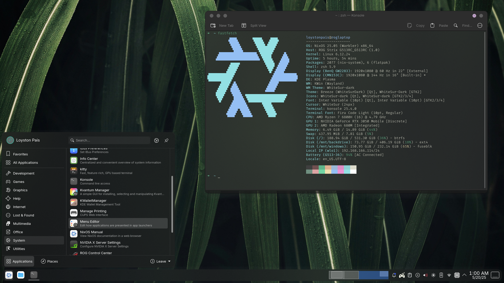
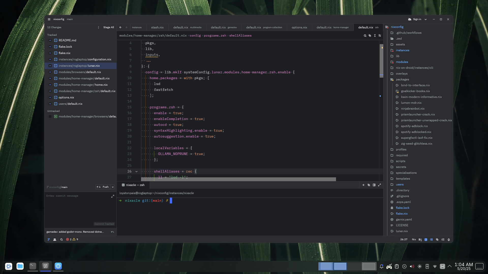

# Lunar Nix

  

A personal NixOS configuration for a reliable, reproducible desktop setup.

## Infrastructure

This configuration manages both desktops and cloud VPS:

- **Desktops** - Personal workstations with KDE Plasma 6
- **nixacle** - Cloud VPS running services and workloads
- **diviner** - Cloud VPS for additional services

## What is NixOS?

NixOS is a Linux distribution where you define your entire system configuration in code. Instead of manually installing packages, editing config files, and hoping nothing breaks on update, you write declarative configuration files that describe exactly what your system should look like. The system can then reproduce that exact setup on any machine or roll back to a previous state if something goes wrong.

This means:
- **Reproducible** - Same config = same system, every time
- **Reliable** - Roll back easily if updates break things
- **Declarative** - You describe *what* you want, not *how* to get there

## Screenshots

More in `assets/screenshots/`
